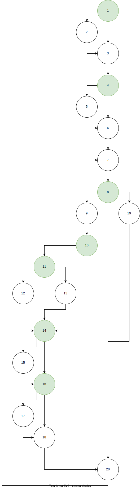

### Цикломатската комплексност

Цикломатската комплексност C ја одредив преку бројот на предикатни јазли,
во мојот control flow graph.

Има 7 такви јазли.

C = 7 + 1 = 8

### Објаснување за тест случаите за Every Branch критериумот

Со користење на листите:
големина 9 [0 # 0 # 0 # 0 # 0]
големина 4 [0 # 0 0]
големина 3 [0 # #]
големина 0

се обидов да ги покријам сите предикатни јазли.
во кодот ќе забележите коментари кои ги означуваат јазлите
кои треба да се покриени од тој дел од тестот.

Листите со должина 0 и 3 се дадени за да се провери дали
кодот ќе сигнализира дека има проблем со должината на листите.

Листите со големина 4 и 9 се одбрани со специфични елементи,
така што листата со големина 4 има само една мина, на десниот
горен ќош, додека другата има поле кое е обколено со мини и
со тоа се проверува дали ќе влезе листата во речиси сите
предикатни јазли и да ја собере најголемата вредност 4 за едно
поле.

Истотака има уште една листа, која мене ми беше најинтересна,
целата е мини. Нема слободен простор да се забележи бројот на
мини. Кодот се справува и со овој тест.

### Објаснување за тест случаите за Every Statement критериумот

За овој критериум, доволно беше да се провери со листата од
големина 9. Доколку помине успешно овој тест, тогаш со сигурност
може да кажеме дека се поминати сите линии код.

Листите со големина 0 и 3 повторно се дадени тука, бидејќи листата
со големина 9 не ги опфаќа тие линии.

